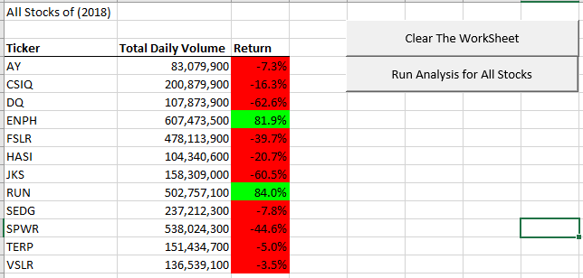

# All Stocks Analysis - Challenge 

This is a sample of the Stock-Analysis for all stocks in a year. A end user will enter a year 2017 or 2018 to read the correspond worksheet to analyze all stock tickers.
The stock tickers are the list of symbols sorted in alphabet order and ascending date. The goal is to write macro subroutine to quickly print out of the analysis data table with three columns:
**ticker, total daily volume, and return** in the year. 

#### Requirement

Writing VBA marco with the best performance such as to read once data cells from the selected worksheet and to format the output table like below:

- Total Daily Volume is like 1,000,000
- Return is like 10.0%
- Return cell is green if the return is positive number
- Return cell is red if the return is negative number

#### Output:

#### VBA Steps:

- Get year to analysis
- Create Title "All Stocks of [Year]"
- Create Output Table header: Ticker, Total Daily Volume
- Create a ticker array with symbols
- Create arrays for totalVolumnes, startingPrices, endingPrices with zero value (hold values to fill the output table)
- Create tickerIndex and ticker (Keep tracking the current ticker)
- Loop through the data values from the selected year worksheet
- Select new ticker if the current row ticker is different the current ticker
- Accumulate the total Volumne of current ticker
- Find the startingPrices of current ticker if it is the fisrt value
- Find the startingPrices of current ticker if it is the last value
- Exit Loop
- Fill the output table with (totalVolumnes, startingPrices, endingPrices) array
- Format the table

#### Solution:

[Green Stocks](green_stocks.xlsm)

